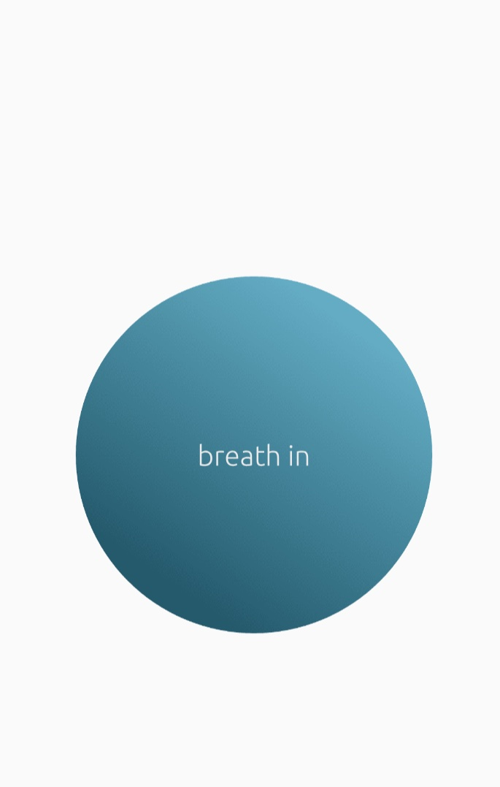
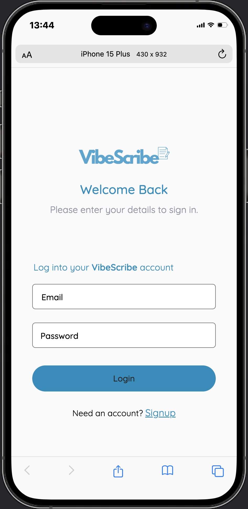
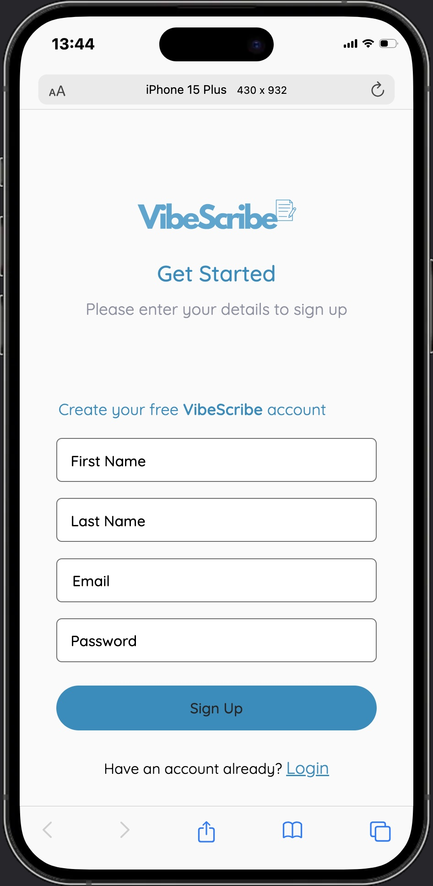
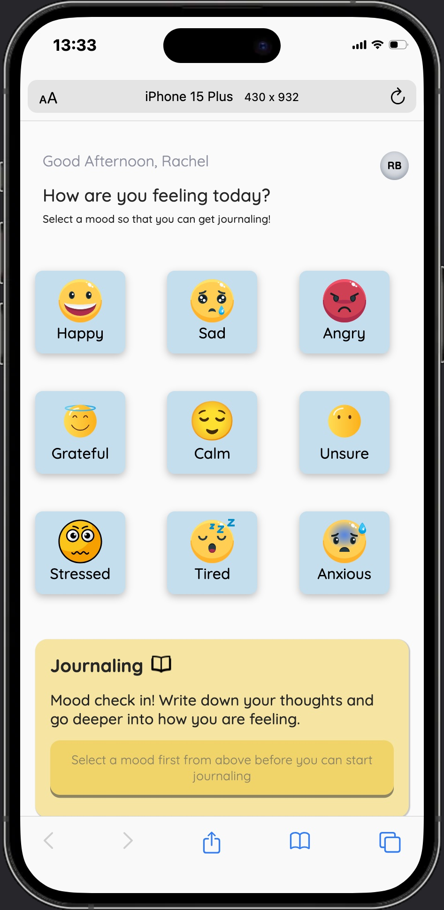
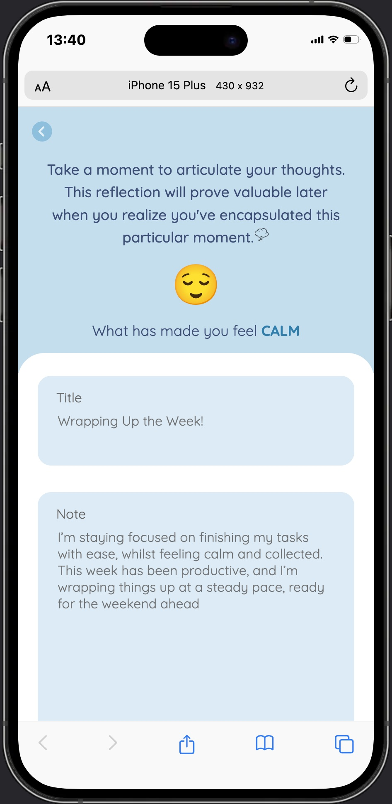
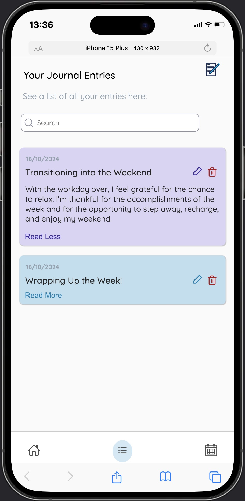
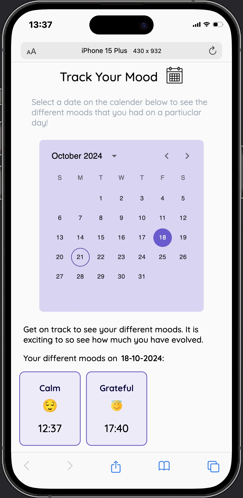
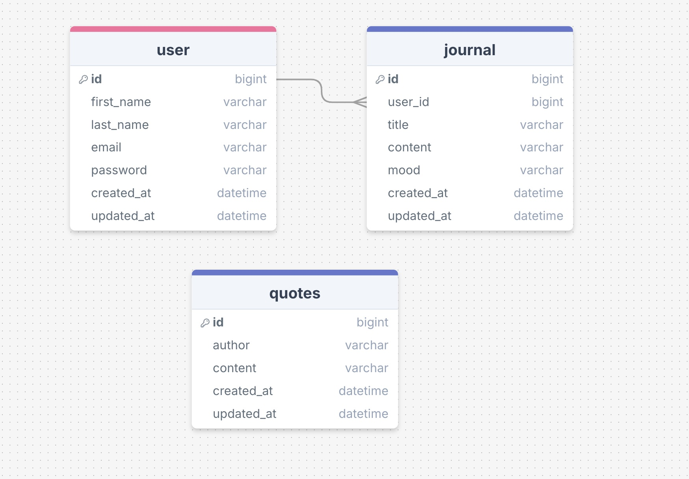

# VibeScribe

## Overview

- An app that allows users to track their emotional well-being by selecting their mood, making journal entries, and reviewing their progress through a calendar.

## Features

- **Mood Selection**:

  - Users can select from a variety of predefined moods.

- **Journal Creation and Management**:

  - Create, view, edit, and delete journal entries. Users can write about their daily experiences, thoughts, and feelings.

- **Search Functionality**:

  - Easily search for specific journal entries by keywords, making it simple to revisit past thoughts.

- **Mood Tracking Calendar**:

  - Users can track their mood daily and see their mood patterns by using a calender.

- **Responsive Design**:

  - Fully responsive layout that works seamlessly on mobile, tablet, and desktop devices.

- **User Authentication**:

  - Users can create accounts and log in securely to keep their journal entries private.

## Tech Stack

- **Frontend:** HTML, CSS, SASS, BEM, JavaScript, React, MUI, Swiper.
- **Backend:** Node.js, Express, MySQL, Knex.js.

## Screenshots

| Landing Page                                          | Breathing Page                                        |
| ----------------------------------------------------- | ----------------------------------------------------- |
|  |  |

| Login Page                                    | Signup Page                                     |
| --------------------------------------------- | ----------------------------------------------- |
|  |  |

| Home Page                                       | Home Page (Cont)                                          | Journal Page                                          |
| ----------------------------------------------- | --------------------------------------------------------- | ----------------------------------------------------- |
|  | .jpeg>) |  |

| Journal Page (Cont)                                             | Journal Entry Page                                              | Tracker Page                                     |
| --------------------------------------------------------------- | --------------------------------------------------------------- | ------------------------------------------------ |
| .jpeg>) |  |  |

## Sitemap

### Landing Page (`/`) - Mobile Only

- The landing page is displayed exclusively on mobile. Users on tablet and desktop devices are taken directly to the Login Page.
- Features the VibeScribe logo, which is shown for two seconds.

### Breathing Page (`/breathing`) - Mobile Only

- After two seconds, users transition to the Breathing Page, where users can engage with a breathing circle to promote relaxation.
- Following the Breathing Page, users are directed to the Login Page for authentication.
- Users on tablet and desktop devices are taken directly to the Login Page.

### Login Page (`/login`)

- Allows users to log in by providing their email and password.

### Signup Page (`/singup`)

- Allows users to sign up by providing their first name, last name, email, and password.

### Home/Profile Page (`/profile`)

- **The Profile Page functions as the Home Page of the app**.
- Mood Selection: Users can select from various moods.
- Journal Entry Call To Action Card: A call to action card which directs users to the journal page. The button to create a journal is initially disabled until a mood is selected, ensuring users engage with the mood selection process first.
- Mood Calendar Call To Action Card: Another call to action card directs users to the mood calendar. Clicking this button takes users to the tracker page, allowing them to view and track their moods over time.
- Motivational Quotes Slider: A slider that displays one motivational quote at a time and automatically transitions to the next quote.

### Journal Page (`/journal/new`)

- Where users can make a new journal entry by providing both a title and content.

### Journal Entries Page (`/journal-entries`)

- This page displays all the user’s journal entries.
- Users can view, search, edit, or delete existing journals from this page.
- Each journal entry shows the title, content and date.

### Journal Edit Page (`/journal/edit/:journalId`)

- Where users can edit their journal entry (specifically the title and the content).

### Tracker Page (`/tracker`):

- The Tracker Page features a calendar that allows users to check their moods on different days.
- Each day displays the corresponding mood along with the time of the entry, enabling users to track their emotional journey.

## API

- Built my own API for motivational quotes.
- The API delivers a collection of motivational quotes, which serves as a source of inspiration and encouragement for users.

## Endpoints

| Method | Endpoint       | Description                                                                        |
| ------ | -------------- | ---------------------------------------------------------------------------------- |
| GET    | `/journal`     | Retrieves the list of a user’s journals.                                           |
| GET    | `/journal/:id` | Retrieves a specific journal by ID for the user.                                   |
| POST   | `/journal`     | Create a new journal entry with a title, content and selected mood.                |
| PATCH  | `/journal/:id` | Update a specific journal by ID for the user (includes updated title and content). |
| DELETE | `/journal/:id` | Delete a specific journal by ID for the user.                                      |

| Method | Endpoint  | Description           |
| ------ | --------- | --------------------- |
| GET    | `/quotes` | Retrieves all quotes. |

## Data

## Authentication

- This app uses basic authentication.
- Users must provide their email and password to log in.
- Users can sign up for a new account.

## Developer Installation Guide

- Log in to MySQL: `mysql -u root -p`, then type in your password when prompted.

- Server side:

  - Run `npm install` to install any dependencies
  - Create a local `.env` file with the necessary environment variables. Refer to the `env.sample` file.
  - Apply the latest migrations to your database: `npx knex migrate:latest`.
  - Populate the database table with sample data: `npx knex seed:run`
  - Launch the server using `npm start`.

- Client side:
  - Run `npm install` to install any dependencies.
  - Create a local `.env` file with the necessary environment variables see `env.sample` file.
  - To view the React app in your browser, run `npm start`.
